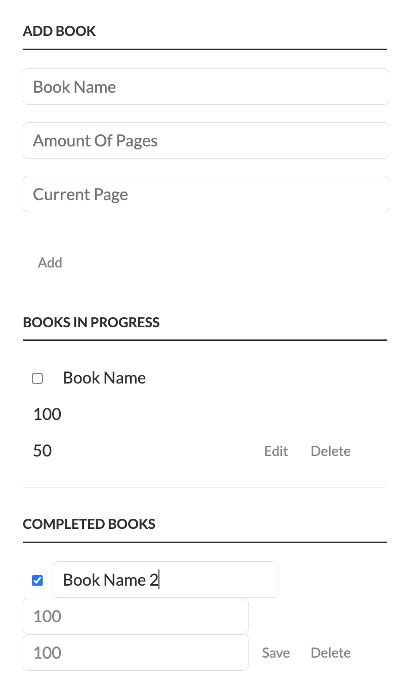
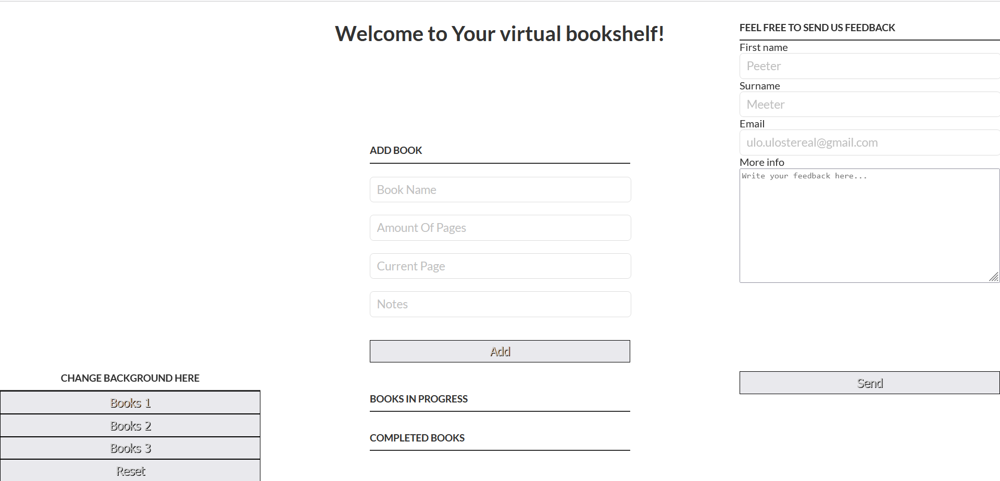

Raamaturiiul
======
Autorid: Kati Põdra & Sten Muinast

### Ekraanitõmmis Rakendusest




### Rakenduse Funktsionaalsuse Kirjeldus

Rakendus koosneb neljast peamisest funktsionaalsest komponendist.

- Loo raamatu sissekanne
- Muutke raamatu andmeid ja lugemise edenemist
- Raamatu kirje kustutamine
- Tagasiside väljade täitmine

Koostati ka kaks nimekirja koos raamatute kuvamisega, üks aktiivse lugemise ja teine ​​loetud raamatute jaoks.

Üleminek aktiivsest loendist lugemisloendisse toimub siis, kui klõpsate raamatu pealkirjast vasakul asuvat märkeruutu.

Disain on täielikult tundlik ja kasutajasõbralik.

### Koodi näited

#### Kirje loomine

```
const addBook = function () {
    const listItemBookName = bookNameInput.value || "Book Name";
    const listItemBookAmountOfPages = bookPagesAmountInput.value || 0;
    const listItemBookCurrentPage = bookCurrentPageInput.value || 0;
    const listItem = createNewBookElement(listItemBookName, listItemBookAmountOfPages, listItemBookCurrentPage);
    incompleteBooksHolder.appendChild(listItem);
    bindBookEvents(listItem, bookCompleted);

    bookNameInput.value = "";
    bookPagesAmountInput.value = "";
    bookCurrentPageInput.value = "";
};
```

#### Raamatuandmete muutmine ja lugemise edenemine

```
const editBookInfo = function () {
    const listItem = this.parentNode;

    const editInputName = listItem.querySelector('input[id="input-name"]');
    const editInputAmountOfPages = listItem.querySelector('input[id="input-pages"]');
    const editInputProgress = listItem.querySelector('input[id="input-progress"]');

    const labelName = listItem.querySelector("label[id='label-name']");
    const labelAmountOfPages = listItem.querySelector("label[id='label-pages']");
    const labelProgress = listItem.querySelector("label[id='label-progress']");

    const button = listItem.getElementsByTagName("button")[0];

    const containsClass = listItem.classList.contains("editMode");

    if (containsClass) {
        labelName.innerText = editInputName.value;
        labelAmountOfPages.innerText = editInputAmountOfPages.value;
        labelProgress.innerText = editInputProgress.value;
        button.innerText = "Edit";
    } else {
        editInputName.value = labelName.innerText || "";
        editInputAmountOfPages.value = labelAmountOfPages.innerText || "";
        editInputProgress.value = labelProgress.innerText || "";
        button.innerText = "Save";
    }

    listItem.classList.toggle("editMode");
};
```

### Kataloogi paigutus

```
.
├── /css/ # CSS-kaust
│ └── /style.css # CSS-i põhi fail
├── /js/ # JavaScripti kaust
│ └── /app.js # Peamine rakenduse fail
├── .gitignore # Versioonikontrolli väljajätmise fail
│── index.html # Peamine sisenemispunkt
│── README.md # See fail
└── screenshot.png # Rakenduse ekraanipilt
```

